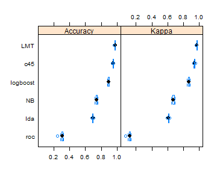

Prediction Assignment Writeup
========================================================

Our goal is to train the model that predicts classe of activity and use it to predict activity in the testing data frame. We get the inspiration from process described on the caret web page http://topepo.github.io/caret/training.html and the lectures.

So, our steps will be:

1. Obtaining the data
2. Selecting features for training
3. Try couple of methods
4. Tune parameters for the most promising
5. Calculate the error of final model on testing set
6. Predict classes for testing data frame

**obtaining the data**


```r
library(RCurl)

if(!file.exists("pml-training.csv")){
  data <- getURL("https://d396qusza40orc.cloudfront.net/predmachlearn/pml-training.csv",ssl.verifypeer=0L,followlocation=1L)
  writeLines(data,'pml-training.csv')
}

if(!file.exists("pml-testing.csv")){
  data <- getURL("https://d396qusza40orc.cloudfront.net/predmachlearn/pml-testing.csv",ssl.verifypeer=0L,followlocation=1L)
  writeLines(data,'pml-testing.csv')
}

training<-read.csv("pml-training.csv")
testing<-read.csv("pml-testing.csv")
```

**Select useful features and make training and testing data set**

Let's take a look at testing data frame columns:


```r
str(testing)
```

```
## 'data.frame':	20 obs. of  160 variables:
##  $ X                       : int  1 2 3 4 5 6 7 8 9 10 ...
##  $ user_name               : Factor w/ 6 levels "adelmo","carlitos",..: 6 5 5 1 4 5 5 5 2 3 ...
##  $ raw_timestamp_part_1    : int  1323095002 1322673067 1322673075 1322832789 1322489635 1322673149 1322673128 1322673076 1323084240 1322837822 ...
##  $ raw_timestamp_part_2    : int  868349 778725 342967 560311 814776 510661 766645 54671 916313 384285 ...
##  $ cvtd_timestamp          : Factor w/ 11 levels "02/12/2011 13:33",..: 5 10 10 1 6 11 11 10 3 2 ...
##  $ new_window              : Factor w/ 1 level "no": 1 1 1 1 1 1 1 1 1 1 ...
##  $ num_window              : int  74 431 439 194 235 504 485 440 323 664 ...
##  $ roll_belt               : num  123 1.02 0.87 125 1.35 -5.92 1.2 0.43 0.93 114 ...
##  $ pitch_belt              : num  27 4.87 1.82 -41.6 3.33 1.59 4.44 4.15 6.72 22.4 ...
##  $ yaw_belt                : num  -4.75 -88.9 -88.5 162 -88.6 -87.7 -87.3 -88.5 -93.7 -13.1 ...
##  $ total_accel_belt        : int  20 4 5 17 3 4 4 4 4 18 ...
##  $ kurtosis_roll_belt      : logi  NA NA NA NA NA NA ...
##  $ kurtosis_picth_belt     : logi  NA NA NA NA NA NA ...
##  $ kurtosis_yaw_belt       : logi  NA NA NA NA NA NA ...
##  $ skewness_roll_belt      : logi  NA NA NA NA NA NA ...
##  $ skewness_roll_belt.1    : logi  NA NA NA NA NA NA ...
##  $ skewness_yaw_belt       : logi  NA NA NA NA NA NA ...
##  $ max_roll_belt           : logi  NA NA NA NA NA NA ...
##  $ max_picth_belt          : logi  NA NA NA NA NA NA ...
##  $ max_yaw_belt            : logi  NA NA NA NA NA NA ...
##  $ min_roll_belt           : logi  NA NA NA NA NA NA ...
##  $ min_pitch_belt          : logi  NA NA NA NA NA NA ...
##  $ min_yaw_belt            : logi  NA NA NA NA NA NA ...
##  $ amplitude_roll_belt     : logi  NA NA NA NA NA NA ...
##  $ amplitude_pitch_belt    : logi  NA NA NA NA NA NA ...
##  $ amplitude_yaw_belt      : logi  NA NA NA NA NA NA ...
##  $ var_total_accel_belt    : logi  NA NA NA NA NA NA ...
##  $ avg_roll_belt           : logi  NA NA NA NA NA NA ...
##  $ stddev_roll_belt        : logi  NA NA NA NA NA NA ...
##  $ var_roll_belt           : logi  NA NA NA NA NA NA ...
##  $ avg_pitch_belt          : logi  NA NA NA NA NA NA ...
##  $ stddev_pitch_belt       : logi  NA NA NA NA NA NA ...
##  $ var_pitch_belt          : logi  NA NA NA NA NA NA ...
##  $ avg_yaw_belt            : logi  NA NA NA NA NA NA ...
##  $ stddev_yaw_belt         : logi  NA NA NA NA NA NA ...
##  $ var_yaw_belt            : logi  NA NA NA NA NA NA ...
##  $ gyros_belt_x            : num  -0.5 -0.06 0.05 0.11 0.03 0.1 -0.06 -0.18 0.1 0.14 ...
##  $ gyros_belt_y            : num  -0.02 -0.02 0.02 0.11 0.02 0.05 0 -0.02 0 0.11 ...
##  $ gyros_belt_z            : num  -0.46 -0.07 0.03 -0.16 0 -0.13 0 -0.03 -0.02 -0.16 ...
##  $ accel_belt_x            : int  -38 -13 1 46 -8 -11 -14 -10 -15 -25 ...
##  $ accel_belt_y            : int  69 11 -1 45 4 -16 2 -2 1 63 ...
##  $ accel_belt_z            : int  -179 39 49 -156 27 38 35 42 32 -158 ...
##  $ magnet_belt_x           : int  -13 43 29 169 33 31 50 39 -6 10 ...
##  $ magnet_belt_y           : int  581 636 631 608 566 638 622 635 600 601 ...
##  $ magnet_belt_z           : int  -382 -309 -312 -304 -418 -291 -315 -305 -302 -330 ...
##  $ roll_arm                : num  40.7 0 0 -109 76.1 0 0 0 -137 -82.4 ...
##  $ pitch_arm               : num  -27.8 0 0 55 2.76 0 0 0 11.2 -63.8 ...
##  $ yaw_arm                 : num  178 0 0 -142 102 0 0 0 -167 -75.3 ...
##  $ total_accel_arm         : int  10 38 44 25 29 14 15 22 34 32 ...
##  $ var_accel_arm           : logi  NA NA NA NA NA NA ...
##  $ avg_roll_arm            : logi  NA NA NA NA NA NA ...
##  $ stddev_roll_arm         : logi  NA NA NA NA NA NA ...
##  $ var_roll_arm            : logi  NA NA NA NA NA NA ...
##  $ avg_pitch_arm           : logi  NA NA NA NA NA NA ...
##  $ stddev_pitch_arm        : logi  NA NA NA NA NA NA ...
##  $ var_pitch_arm           : logi  NA NA NA NA NA NA ...
##  $ avg_yaw_arm             : logi  NA NA NA NA NA NA ...
##  $ stddev_yaw_arm          : logi  NA NA NA NA NA NA ...
##  $ var_yaw_arm             : logi  NA NA NA NA NA NA ...
##  $ gyros_arm_x             : num  -1.65 -1.17 2.1 0.22 -1.96 0.02 2.36 -3.71 0.03 0.26 ...
##  $ gyros_arm_y             : num  0.48 0.85 -1.36 -0.51 0.79 0.05 -1.01 1.85 -0.02 -0.5 ...
##  $ gyros_arm_z             : num  -0.18 -0.43 1.13 0.92 -0.54 -0.07 0.89 -0.69 -0.02 0.79 ...
##  $ accel_arm_x             : int  16 -290 -341 -238 -197 -26 99 -98 -287 -301 ...
##  $ accel_arm_y             : int  38 215 245 -57 200 130 79 175 111 -42 ...
##  $ accel_arm_z             : int  93 -90 -87 6 -30 -19 -67 -78 -122 -80 ...
##  $ magnet_arm_x            : int  -326 -325 -264 -173 -170 396 702 535 -367 -420 ...
##  $ magnet_arm_y            : int  385 447 474 257 275 176 15 215 335 294 ...
##  $ magnet_arm_z            : int  481 434 413 633 617 516 217 385 520 493 ...
##  $ kurtosis_roll_arm       : logi  NA NA NA NA NA NA ...
##  $ kurtosis_picth_arm      : logi  NA NA NA NA NA NA ...
##  $ kurtosis_yaw_arm        : logi  NA NA NA NA NA NA ...
##  $ skewness_roll_arm       : logi  NA NA NA NA NA NA ...
##  $ skewness_pitch_arm      : logi  NA NA NA NA NA NA ...
##  $ skewness_yaw_arm        : logi  NA NA NA NA NA NA ...
##  $ max_roll_arm            : logi  NA NA NA NA NA NA ...
##  $ max_picth_arm           : logi  NA NA NA NA NA NA ...
##  $ max_yaw_arm             : logi  NA NA NA NA NA NA ...
##  $ min_roll_arm            : logi  NA NA NA NA NA NA ...
##  $ min_pitch_arm           : logi  NA NA NA NA NA NA ...
##  $ min_yaw_arm             : logi  NA NA NA NA NA NA ...
##  $ amplitude_roll_arm      : logi  NA NA NA NA NA NA ...
##  $ amplitude_pitch_arm     : logi  NA NA NA NA NA NA ...
##  $ amplitude_yaw_arm       : logi  NA NA NA NA NA NA ...
##  $ roll_dumbbell           : num  -17.7 54.5 57.1 43.1 -101.4 ...
##  $ pitch_dumbbell          : num  25 -53.7 -51.4 -30 -53.4 ...
##  $ yaw_dumbbell            : num  126.2 -75.5 -75.2 -103.3 -14.2 ...
##  $ kurtosis_roll_dumbbell  : logi  NA NA NA NA NA NA ...
##  $ kurtosis_picth_dumbbell : logi  NA NA NA NA NA NA ...
##  $ kurtosis_yaw_dumbbell   : logi  NA NA NA NA NA NA ...
##  $ skewness_roll_dumbbell  : logi  NA NA NA NA NA NA ...
##  $ skewness_pitch_dumbbell : logi  NA NA NA NA NA NA ...
##  $ skewness_yaw_dumbbell   : logi  NA NA NA NA NA NA ...
##  $ max_roll_dumbbell       : logi  NA NA NA NA NA NA ...
##  $ max_picth_dumbbell      : logi  NA NA NA NA NA NA ...
##  $ max_yaw_dumbbell        : logi  NA NA NA NA NA NA ...
##  $ min_roll_dumbbell       : logi  NA NA NA NA NA NA ...
##  $ min_pitch_dumbbell      : logi  NA NA NA NA NA NA ...
##  $ min_yaw_dumbbell        : logi  NA NA NA NA NA NA ...
##  $ amplitude_roll_dumbbell : logi  NA NA NA NA NA NA ...
##   [list output truncated]
```

As we can see most columns are useless in the testing set, so we select only those, which can be useful.


```r
library(caret)
```

```
## Loading required package: lattice
## Loading required package: ggplot2
```

```r
#select only useful columns by name and regular expression
trainingset<-training[,c(names(training)[grepl(pattern="_(x|y|z)$|^(roll|pitch|yaw)",names(training))],"classe","user_name","new_window")]

#split data into testing and training
intrain <- createDataPartition(y=trainingset$classe,p=0.8,list=F)
training_split <- trainingset[intrain,]
testing_split <- trainingset[-intrain,]
```


**Now it is time to try several methods**

We are trying to predict multiclass object, and most of classification methods do not support it.
Currently we are using not very powerful laptop, so we are not going to try too demanding methods like RandomForests. We will try different methods that can do multiclassification and from different areas:
* NaiveBayes
* Logistic Model Trees
* Linear Discriminant Analysis
* Boosted Logistic Regression
* ROC-Based Classifier
* c45


```r
set.seed(1234)
library(caret)
library(klaR)
library(RWeka)
library(MASS)
library(caTools)
library(caTools)
library(caTools)

accuracyResult<-data.frame(model=c("none"),Accuracy=c(0),stringsAsFactors = FALSE)

methods<-c(LMT="LMT",nb="NB",lda="lda",LogitBoost="logboost",rocc="roc",J48="c45")

for (k in names(methods)){
  if (file.exists(paste(k,"rda",sep="."))){
    load(paste(k,"rda",sep="."))
    model<-get(methods[k])
  }  else {
    model<-train(training_split[,1:(ncol(testing_split)-1)],training_split$classe,method = k)
  }
  accuracyResult<-rbind(accuracyResult,c(k,model$results$Accuracy))
}
RL<-list()
for (k in methods){
  RL[[k]]=get(k)
}
resamps<-resamples(RL)
```
 

```r
accuracyResult[-1,]
```

```
##        model          Accuracy
## 2        LMT 0.962724001800405
## 3         nb 0.517832869262667
## 4        lda 0.692953294431058
## 5 LogitBoost 0.822753920592968
## 6       rocc 0.278935026806715
## 7        J48 0.950269597110398
```

As we can see, we have a leader: Logistic Model Trees (LMT). But it is too slow in comparison with C4.5 model, that is why we are going to tune C4.5

**Tuning parameters**

Now we will try to get maximun from C4.5 by tuning its parameter in cross-validation
C4.5 has one tuning paraneter - C. We'll use it


```r
#create grid for iter
C45Grid <-  expand.grid(C = seq(0.2,0.3,0.01))
#set cross validation
ctrl <- trainControl(method = "cv", number = 10)
if (file.exists("C45_tuning.rda")){
  load("C45_tuning.rda")
} else {
  C45_CV <- train(subset(training_split,select=-c(classe)),training_split$classe,method = "J48",trControl = ctrl,tuneGrid = C45Grid)
}
```


```r
C45_CV
```

```
## C4.5-like Trees 
## 
## 15699 samples
##    50 predictors
##     5 classes: 'A', 'B', 'C', 'D', 'E' 
## 
## No pre-processing
## Resampling: Cross-Validated (10 fold) 
## 
## Summary of sample sizes: 14129, 14130, 14131, 14129, 14127, 14129, ... 
## 
## Resampling results across tuning parameters:
## 
##   C    Accuracy  Kappa  Accuracy SD  Kappa SD
##   0.2  1         0.9    0.005        0.006   
##   0.2  1         0.9    0.005        0.006   
##   0.2  1         0.9    0.005        0.006   
##   0.2  1         0.9    0.005        0.006   
##   0.2  1         0.9    0.005        0.006   
##   0.2  1         0.9    0.005        0.006   
##   0.3  1         0.9    0.005        0.006   
##   0.3  1         0.9    0.005        0.006   
##   0.3  1         0.9    0.005        0.006   
##   0.3  1         0.9    0.005        0.006   
##   0.3  1         0.9    0.005        0.006   
## 
## Accuracy was used to select the optimal model using  the largest value.
## The final value used for the model was C = 0.3.
```

**calculate out of sample error**

We use confusion matrix


```r
predict<-predict(C45_CV,testing_split)
confusionMatrix(predict,testing_split$classe)
```

```
## Confusion Matrix and Statistics
## 
##           Reference
## Prediction    A    B    C    D    E
##          A 1083   11    2    7    2
##          B   15  715   16    6    7
##          C    7   14  655   22    5
##          D    7   10    9  600    5
##          E    4    9    2    8  702
## 
## Overall Statistics
##                                        
##                Accuracy : 0.957        
##                  95% CI : (0.95, 0.963)
##     No Information Rate : 0.284        
##     P-Value [Acc > NIR] : <2e-16       
##                                        
##                   Kappa : 0.946        
##  Mcnemar's Test P-Value : 0.231        
## 
## Statistics by Class:
## 
##                      Class: A Class: B Class: C Class: D Class: E
## Sensitivity             0.970    0.942    0.958    0.933    0.974
## Specificity             0.992    0.986    0.985    0.991    0.993
## Pos Pred Value          0.980    0.942    0.932    0.951    0.968
## Neg Pred Value          0.988    0.986    0.991    0.987    0.994
## Prevalence              0.284    0.193    0.174    0.164    0.184
## Detection Rate          0.276    0.182    0.167    0.153    0.179
## Detection Prevalence    0.282    0.193    0.179    0.161    0.185
## Balanced Accuracy       0.981    0.964    0.971    0.962    0.983
```

looks like ins testing split we get the result similar to cross-validation. And we have 95.86% confidence that our accuracy is higher than 97%. We will use this model for future predictions
